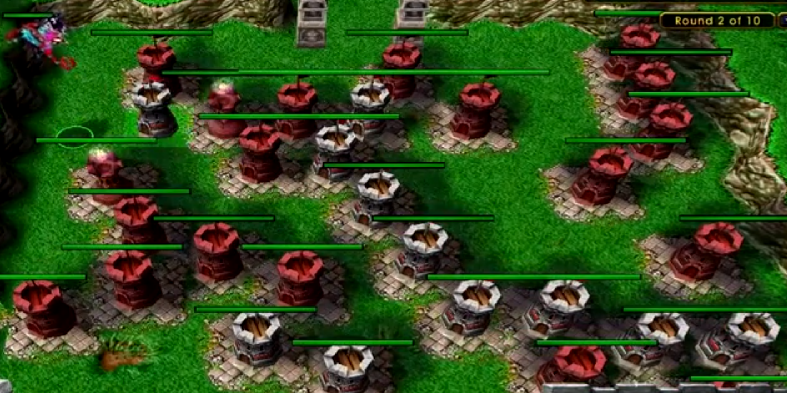

# 프로젝트 발표

## 주제 : 미로 건설 게임
 #### 내용 : 장벽들과 특수한 건설물들을 이용하여 목표한 시간만큼 동안 적들의 침입을 최대한 지연시키자

## 유사한 게임 이미지
  

## 게임 진행 방식 
 #### 1. 각 스테이지마다 목표되는 지연 시간이 존재하며 충족 시에 클리어
 #### 2. 기존의 존재하는 장벽들과 함께 새로히 장벽들을 건설하여 최대한 적들의 칩입을 지연
 #### 3. 기존의 장벽들은 그 위치가 고정되어있으며 건설 가능한 건축물들의 개수는 제한됨
 
